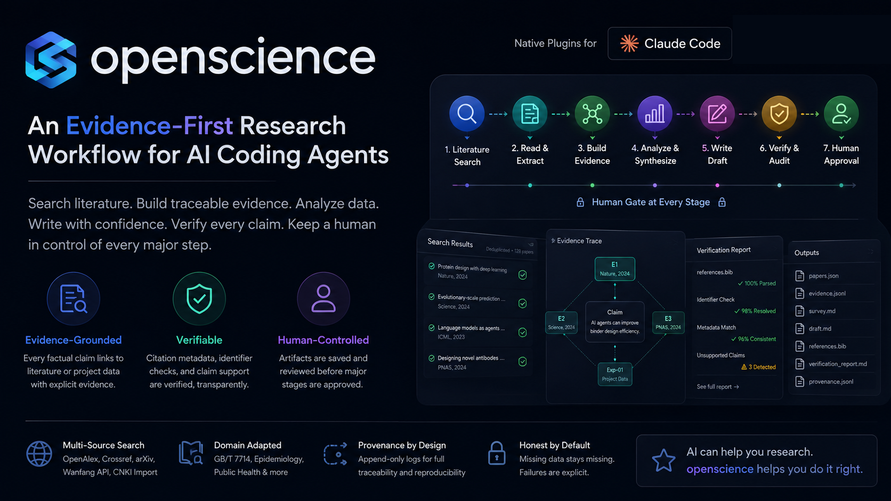

# openscience

Search literature, build traceable evidence, analyze data, write drafts, verify citations — and keep a human in control of every major research step.

[Quick start](#quick-start) · [See it work](#see-it-work) · [Research packs](#research-packs) · [Architecture](docs/architecture.md) · [Examples](examples/)

**Evidence, not memory** — factual claims are mapped back to literature or project data; unsupported claims are surfaced explicitly.
**Verification built in** — citation metadata, identifier conflicts, and unsupported claims are checked by machine, not vibes.
**Human-controlled workflow** — artifacts are saved to disk before each major stage is approved, revised, or rejected.

> A failed search is a source gap, not a scientific conclusion.

## Why openscience?

A general coding agent can already search, code, and write. What it cannot do out of the box:

| Problem | What openscience does |
| --- | --- |
| Research is not one chat — it's a stateful, multi-stage process | A lifecycle router with persisted stages (`question → literature → hypothesis → experiment → analysis → writing`) and resume-from-disk |
| Claims in drafts drift away from sources | An explicit evidence chain: retrieval → `EvidenceItem` → whitelisted synthesis → draft → claim support check |
| Agents run end-to-end without asking | Stage gates: each lifecycle stage writes its artifacts first, then pauses for `approve / revise / reject` |
| Chinese research workflows are second-class everywhere | CNKI bibliography import, Wanfang API, GB/T 7714 citations, and an epidemiology/public-health pack |

## See it work

```text
You:
"调研 2023–2026 年 LLM agent 做蛋白 binder design 的进展，
找出主要方法、失败模式和可验证的研究空白。"

openscience:
 1. searches OpenAlex / Crossref / arXiv / Wanfang, dedupes into papers.json
 2. reads full text where available — everything else is honestly marked abstract-only
 3. maps claims ↔ evidence (EvidenceItem with verbatim quotes + page anchors)
 4. synthesizes an 8-field literature survey
 5. writes the draft (GB/T 7714 + references.bib)
 6. verifies every BibTeX entry via bibverify MCP
 7. flags unsupported claims and retrieves missing evidence
 8. stops — you approve, revise, or reject
```

Everything lands on disk:

```text
papers.json · evidence.json · survey.md · draft.md · references.bib
citation report · .openscience/provenance.jsonl
```

## Quick start

Requirements: Python 3.11+, [uv](https://docs.astral.sh/uv/), and Claude Code.

```text
/plugin marketplace add Hylouis233/openscience
/plugin install science-core@openscience
/plugin install science-literature@openscience
/plugin install science-verify@openscience
```

Then just ask in natural language:

```text
帮我调研过去三年蛋白质 binder design 中 AI agent 的进展，
重点比较自动化设计流程、实验验证和失败案例。
```

openscience routes the request through `literature-search → paper-read → literature-survey → review-writing → citation-verify` automatically. First run, it will ask you to complete a short `cold-start-interview` to build your research profile (field, data sources, compute, writing style).

## What gets verified — and what doesn't

**Checked:** whether references resolve (DOI/PMID/arXiv), whether returned metadata matches the entry, whether a factual claim has a supporting source, whether the environment and actions are logged.

**Not claimed:** scientific truth. `no_match` means *not found in the queried sources* — never "fabricated". Verification does not prove a claim; it proves the citation trail is real, consistent, and reviewable.

## Research packs

| Pack | Install if you need… |
| --- | --- |
| **science-core** | The workbench: research profile, lifecycle routing, stage gates, provenance, reviewer |
| **science-literature** | Search, read, survey, and write literature (incl. Chinese sources) |
| **science-verify** | Citation verification (bibverify MCP), claim checks, evidence loop |
| science-compute | Python/R analysis, SSH/HPC/Slurm, long-task runs |
| science-data | Domain database connectors with a fail-closed license gate |
| science-epi | Epidemiology & public health (outbreak curves, SEIR, spatial, writing) |

**Recommended starting set:** `science-core` + `science-literature` + `science-verify`.

## Full research lifecycle

```text
question ─► [gate] ─► literature ─► [gate] ─► hypothesis ─► [gate]
        ─► experiment ─► [gate] ─► analysis ─► [gate] ─► writing ─► reviewer
```

When using the full lifecycle, each stage is persisted and paused for human approval before progression. `revise "feedback"` reruns the stage with your note injected — old artifacts are archived, never overwritten. Individual skills can also run standalone.

## Chinese research support

- **CNKI**: no scraping, no captcha bypass — you export a bibliography from cnki.net, `cn-literature` parses it into the shared paper schema
- **Wanfang**: official open-platform API (`WANFANG_TOKEN`; degrades cleanly when unset)
- **GB/T 7714-2015** reference formatting alongside BibTeX
- **science-epi**: outbreak investigation, SEIR modeling, spatial epi, and Chinese public-health writing templates

## Design principles

- **Missing data stays missing.** No full text → `abstract-only`. No database access → source gap. No citation match → `no_match`, not "fabricated".
- **Never turn tool failure into evidence.** Every external call degrades to a structured state, visible in the output.
- **Humans decide at gates.** The agent prepares; you approve.
- **Append-only provenance.** `record_run.py` logs actions and environment fingerprints to `.openscience/provenance.jsonl`.

## Examples

- [`examples/demo-workspace`](examples/demo-workspace/) — standard research workspace layout with sample artifacts
- [`examples/demo-epi`](examples/demo-epi/) — a fully worked outbreak analysis (synthetic data): linelist → epi curve → SEIR → report

## Architecture

Design contracts (review fence, stage gates, slug contract, evidence capsule levels) are documented in [docs/architecture.md](docs/architecture.md). Release and contribution workflow: [docs/publishing.md](docs/publishing.md).

## Design provenance

openscience is an independent implementation informed by several open-source research-agent projects. See [THIRD_PARTY_NOTICES.md](THIRD_PARTY_NOTICES.md) for design references and license attribution — including [Hylouis233/bibverify](https://github.com/Hylouis233/bibverify), the citation-verification MCP.

## License

[MIT](LICENSE) — Copyright (c) 2026 Hylouis233 and contributors.
